# 📊 Diagramas de Arquitectura - Agente CTM

## 🔄 Flujo Completo del Sistema

```mermaid
graph TB
    subgraph "Cliente (test_agent.py)"
        A[👤 Usuario] --> B[Menú de Proyectos]
        B --> C{Selección}
        C -->|Proyecto DB| D[Cargar de projects_database.json]
        C -->|Personalizado| E[Crear Proyecto Manual]
        D --> F[Iniciar Sesión]
        E --> F
    end

    subgraph "API CTM (FastAPI)"
        F --> G[POST /assistants/search]
        G --> H{¿Existe Assistant?}
        H -->|No| I[POST /assistants]
        H -->|Sí| J[Usar Assistant Existente]
        I --> J
        J --> K[POST /threads]
        K --> L[POST /threads/{id}/runs]
    end

    subgraph "LangGraph Server"
        L --> M[Iniciar Ejecución del Grafo]
        M --> N[Nodo: ingest_info]
        N --> O[Nodo: research_opportunities]
        O --> P[Nodo: select_opportunities]
        P --> Q{Interrupción 1}
    end

    subgraph "Interacción Usuario 1"
        Q --> R[GET /threads/{id}/state]
        R --> S[Cliente detecta interrupción]
        S --> T[Usuario selecciona oportunidades]
        T --> U[POST /threads/{id}/runs con selección]
    end

    subgraph "Continuación del Grafo"
        U --> V[Nodo: academic_research]
        V --> W[Búsqueda en APIs externas]
        W --> X[Nodo: generate_report]
        X --> Y[Nodo: chat_responder]
        Y --> Z{Interrupción 2}
    end

    subgraph "Interacción Usuario 2 (Chat Loop)"
        Z --> AA[GET /threads/{id}/state]
        AA --> AB[Cliente detecta chat mode]
        AB --> AC{Usuario pregunta}
        AC -->|Pregunta| AD[POST /threads/{id}/runs con mensaje]
        AD --> AE[LLM genera respuesta]
        AE --> AC
        AC -->|'end'| AF[Finalizar Chat]
    end

    subgraph "Persistencia"
        AF --> AG[GET /threads/{id}/state final]
        AG --> AH[Guardar en threads_history.json]
        AH --> AI[Mostrar Resultados]
    end

    AI --> AJ[🎉 Sesión Completa]

    style A fill:#e1f5ff
    style AJ fill:#c8e6c9
    style Q fill:#fff9c4
    style Z fill:#fff9c4
```

## 🏗️ Arquitectura de Componentes

```mermaid
graph LR
    subgraph "Capa de Cliente"
        CLI[test_agent.py<br/>Mini-Cliente]
        PDB[(projects_database.json)]
        THI[(threads_history.json)]
    end

    subgraph "Capa de API"
        API[FastAPI Server<br/>api_ctm_agent]
        ROUTES[Routers]
        SERVICES[Services]
        MODELS[Models]
    end

    subgraph "Capa de Agente"
        GRAPH[LangGraph<br/>Grafo del Agente]
        NODES[Nodos]
        STATE[State Manager]
    end

    subgraph "Servicios Externos"
        LLM[Google Gemini<br/>LLM]
        SEARCH[APIs de Búsqueda<br/>Oportunidades]
        PAPERS[APIs Académicas<br/>Papers]
    end

    subgraph "Base de Datos (Futura)"
        DB[(PostgreSQL/<br/>MongoDB)]
        CACHE[(Redis Cache)]
    end

    CLI -->|HTTP Requests| API
    CLI -->|Lee| PDB
    CLI -->|Escribe| THI
    
    API --> ROUTES
    ROUTES --> SERVICES
    SERVICES --> MODELS
    SERVICES -->|Invoca| GRAPH
    
    GRAPH --> NODES
    NODES --> STATE
    NODES -->|Consulta| LLM
    NODES -->|Busca| SEARCH
    NODES -->|Investiga| PAPERS
    
    SERVICES -.->|Futuro| DB
    SERVICES -.->|Futuro| CACHE

    style CLI fill:#e3f2fd
    style API fill:#f3e5f5
    style GRAPH fill:#e8f5e9
    style DB fill:#fff3e0
```



## 🔀 Flujo de Datos Detallado

```mermaid
sequenceDiagram
    participant U as 👤 Usuario
    participant C as Cliente (test_agent.py)
    participant API as API FastAPI
    participant LG as LangGraph Server
    participant AG as Agente (Grafo)
    participant LLM as Gemini LLM
    participant EXT as APIs Externas
    participant FS as File System

    Note over U,FS: 1. INICIALIZACIÓN
    U->>C: Ejecuta python test_agent.py
    C->>FS: Lee projects_database.json
    FS-->>C: Lista de proyectos
    C->>U: Muestra menú
    U->>C: Selecciona proyecto

    Note over U,FS: 2. SETUP DE SESIÓN
    C->>API: POST /assistants/search
    API-->>C: Assistant ID
    C->>API: POST /threads
    API-->>C: Thread ID

    Note over U,FS: 3. INICIO DE EJECUCIÓN
    C->>API: POST /threads/{id}/runs<br/>{project_title, project_description}
    API->>LG: Invoke graph
    LG->>AG: Ejecutar grafo

    Note over U,FS: 4. PROCESAMIENTO DEL AGENTE
    AG->>AG: Nodo: ingest_info
    AG->>AG: Nodo: research_opportunities
    AG->>EXT: Buscar oportunidades de financiación
    EXT-->>AG: Lista de oportunidades
    AG->>AG: Nodo: select_opportunities
    AG-->>LG: interrupt() - Pausar ejecución

    Note over U,FS: 5. INTERRUPCIÓN 1: SELECCIÓN
    C->>API: GET /threads/{id}/state (polling)
    API-->>C: State con interrupts
    C->>U: Muestra oportunidades
    U->>C: Selecciona índices [0,1,2]
    C->>API: POST /threads/{id}/runs<br/>{input: [0,1,2]}
    API->>LG: Resume con input
    LG->>AG: Continuar ejecución

    Note over U,FS: 6. INVESTIGACIÓN ACADÉMICA
    AG->>AG: Nodo: academic_research
    AG->>EXT: Buscar papers académicos
    EXT-->>AG: Lista de papers
    AG->>LLM: Analizar papers
    LLM-->>AG: Análisis

    Note over U,FS: 7. GENERACIÓN DE REPORTE
    AG->>AG: Nodo: generate_report
    AG->>LLM: Generar reporte de mejoras
    LLM-->>AG: Reporte completo
    AG->>AG: Nodo: chat_responder
    AG-->>LG: interrupt() - Modo chat

    Note over U,FS: 8. INTERRUPCIÓN 2: CHAT LOOP
    loop Modo Chat
        C->>API: GET /threads/{id}/state (polling)
        API-->>C: State con chat interrupt
        C->>U: Solicita pregunta
        U->>C: Escribe pregunta
        C->>API: POST /threads/{id}/runs<br/>{messages: [{role: user, content: pregunta}]}
        API->>LG: Resume con mensaje
        LG->>AG: Procesar pregunta
        AG->>LLM: Generar respuesta
        LLM-->>AG: Respuesta
        AG-->>C: Respuesta en state
    end
    U->>C: Escribe "end"

    Note over U,FS: 9. FINALIZACIÓN Y PERSISTENCIA
    C->>API: POST /threads/{id}/runs<br/>{messages: [{role: user, content: "end"}]}
    API->>LG: Finalizar ejecución
    LG-->>API: Ejecución completada
    C->>API: GET /threads/{id}/state
    API-->>C: Estado final completo
    C->>FS: Guardar en threads_history.json
    C->>U: Mostrar resultados finales
```



## 🎯 Ciclo de Vida del Thread


## 🗂️ Estructura de Datos


## 🔌 Endpoints y Flujo de API

```mermaid
graph TD
    subgraph "Endpoints de Sistema"
        E1[GET /ok<br/>Health Check]
        E2[GET /info<br/>Server Info]
    end

    subgraph "Endpoints de Assistants"
        E3[POST /assistants<br/>Crear Assistant]
        E4[POST /assistants/search<br/>Buscar Assistants]
        E5[GET /assistants/{id}<br/>Obtener Assistant]
    end

    subgraph "Endpoints de Threads"
        E6[POST /threads<br/>Crear Thread]
        E7[GET /threads/{id}<br/>Obtener Thread]
        E8[GET /threads/{id}/state<br/>Estado del Thread]
    end

    subgraph "Endpoints de Runs"
        E9[POST /threads/{id}/runs<br/>Crear Run]
        E10[POST /threads/{id}/runs/wait<br/>Ejecutar y Esperar]
        E11[GET /threads/{id}/runs/{run_id}<br/>Obtener Run]
    end

    subgraph "Flujo del Cliente"
        F1[Inicio] --> E1
        E1 --> E4
        E4 --> E3
        E3 --> E6
        E6 --> E10
        E10 --> E8
        E8 --> E10
        E10 --> E8
        E8 --> F2[Fin]
    end

    style E10 fill:#ffeb3b
    style E8 fill:#ffeb3b
```

## 🧠 Grafo del Agente (Nodos y Edges)


## 📦 Arquitectura de Archivos

```mermaid
graph TD
    subgraph "Raíz del Proyecto"
        A[test_agent.py]
        B[projects_database.json]
        C[threads_history.json]
        D[README_CLIENTE.md]
    end

    subgraph "api_ctm_agent/"
        E[app/main.py]
        F[app/routers/]
        G[app/services/]
        H[app/models/]
        I[requirements.txt]
    end

    subgraph "ctm-investment-agent/"
        J[src/agent/graph.py]
        K[src/agent/nodes/]
        L[src/agent/state.py]
        M[src/agent/config.py]
    end

    A -->|Lee| B
    A -->|Escribe| C
    A -->|HTTP| E
    E --> F
    F --> G
    G -->|Invoca| J
    J --> K
    K --> L

    style A fill:#e3f2fd
    style E fill:#f3e5f5
    style J fill:#e8f5e9
```



## 🔄 Polling y Detección de Interrupciones

```mermaid
sequenceDiagram
    participant C as Cliente
    participant API as API
    participant AG as Agente

    C->>API: POST /threads/{id}/runs
    API->>AG: Iniciar ejecución
    
    loop Polling cada 2 segundos
        C->>API: GET /threads/{id}/state
        API-->>C: {status: "busy", interrupts: []}
        Note over C: Continuar esperando...
    end

    AG->>AG: interrupt() llamado
    
    C->>API: GET /threads/{id}/state
    API-->>C: {status: "busy", interrupts: [{...}]}
    
    Note over C: ¡Interrupción detectada!
    C->>C: Procesar interrupción
    C->>C: Obtener input del usuario
    
    C->>API: POST /threads/{id}/runs<br/>{input: user_input}
    API->>AG: Resume con input
    
    Note over AG: Continuar ejecución...
```



---

## 📝 Notas de Implementación

### Estado del Thread (ThreadState)
```json
{
  "status": "idle" | "busy" | "error",
  "values": {
    "project_title": "...",
    "project_description": "...",
    "investment_opportunities": [...],
    "selected_opportunities": [...],
    "academic_papers": [...],
    "improvement_report": "...",
    "messages": [...]
  },
  "interrupts": [
    {
      "total_opportunities": 10,
      "opportunities": [...],
      "instruction": "..."
    }
  ],
  "next": ["nombre_del_siguiente_nodo"],
  "checkpoint": {...}
}
```

### Tipos de Interrupciones
1. **Selección de Oportunidades**: Contiene `opportunities` y `total_opportunities`
2. **Modo Chat**: Contiene `topics` y `message`

### Persistencia en threads_history.json
```json
{
  "threads": [
    {
      "thread_id": "...",
      "assistant_id": "...",
      "project_id": "...",
      "project_title": "...",
      "created_at": "2025-10-16T14:30:00",
      "duration_seconds": 245.5,
      "opportunities_found": 15,
      "opportunities_selected": 3,
      "papers_found": 8,
      "report_generated": true,
      "total_interactions": 5,
      "status": "completed"
    }
  ]
}
```
